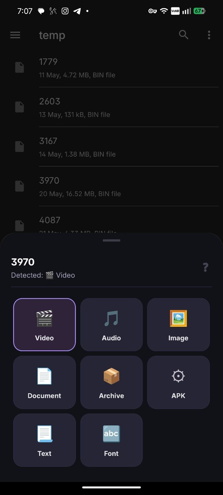

# 🌉 AnyFile Opener (OpenBridge)

**AnyFile Opener** (internally known as **OpenBridge**) is a lightweight Android utility that acts as a universal bridge for file intents. It solves the common "No app can open this file" error and fixes "Permission Denied" issues when opening files from restricted app caches.

[](#overall-progress)
[](https://developer.android.com)

## 🚀 Key Highlights
- **Binary Signature Detection**: Identifies files by their magic bytes (headers), not just unreliable extensions.
- **Robust URI Forwarding**: Ensures target apps (like VLC, MX Player, or Installers) have proper permissions to read files from restricted folders.
- **Universal Handler**: Registers for `*/*` to provide a fallback when the system is stumped.
- **Binary Inspector**: View hex/ASCII previews of file headers directly in the app.
- **Material You & AMOLED**: Personalized themes with dynamic coloring and pure black support.
- **Recent Files & Widgets**: Quick access to your history and system storage roots.

## 🖼 App Screenshot




---

## 📂 Documentation
For detailed technical information, architecture diagrams, and feature lists, please refer to:
👉 **[Project notes](./gemini.md)**

---

## 🛠 Usage

### 1. The "Open with" Flow (Passive)
Simply choose **AnyFile Opener** when clicking a file in any app. The bridge will analyze the file and offer the best categories (Video, Audio, APK, etc.) to re-dispatch the file correctly.

Multiple shared files are kept in a sequential queue. Each item can be opened,
skipped, or used to cancel the remaining queue.

### 2. The Launcher Flow (Active)
Open the app directly to:
- **Pick a File**: Browse storage and manually select a file to open.
- **Force MIME**: Manually type a MIME type (e.g., `application/pdf`) to force-open a mislabelled file.
- **Inspect**: Check the internal header bytes of a file to verify its true type.
- **Default App Rules**: Save and manage per-MIME or per-extension target apps.
- **Detection Details**: Review confidence, detection source, and concrete evidence.

### 3. Home Screen Widget
Add the **Storage Root** widget to your home screen for a one-tap shortcut to the system's internal storage provider.

---

## 🏗 Build & Install

### Prerequisites
- JDK 17
- Android SDK (API 34)

### Build Command
```powershell
./gradlew assembleDebug
```

### Install
```powershell
adb install -r app/build/outputs/apk/debug/app-debug.apk
```

### GitHub Actions

The `Build Android` workflow is intentionally manual. Open the repository's
**Actions** tab, run the workflow, enter a version, and choose whether to create a
GitHub Release. Without signing secrets it produces a debug APK. With
`ANDROID_KEYSTORE_BASE64`, `ANDROID_KEYSTORE_PASSWORD`, `ANDROID_KEY_ALIAS`, and
`ANDROID_KEY_PASSWORD`, it produces a signed release APK.

---

## 📈 Overall Progress
- [x] Magic-byte MIME Detection (33KB deep peek)
- [x] URI Permission Bridging
- [x] Deep peeking for ZIP/Office/ISO formats
- [x] Recent Files History
- [x] Binary Inspector UI
- [x] Home Screen Widgets
- [x] Settings & Themes (Material You, AMOLED)


---

## ⚖ License
This project is provided for utility and educational purposes. See the repository for specific licensing details.
